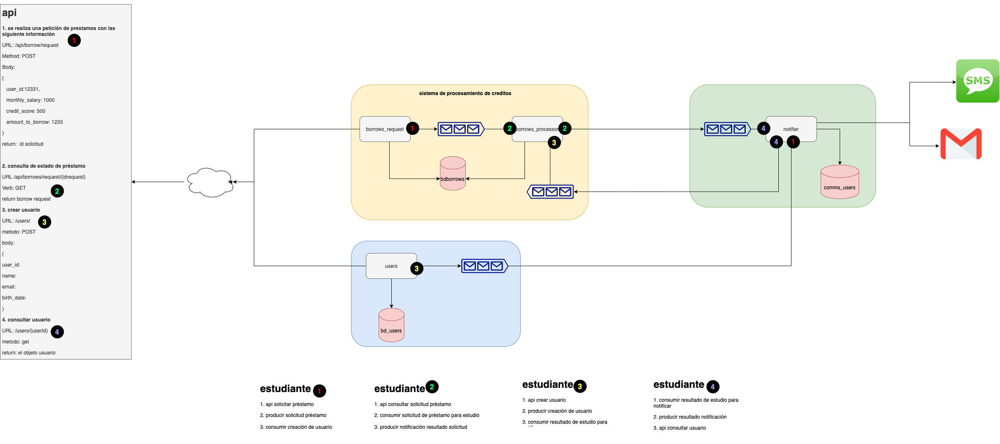
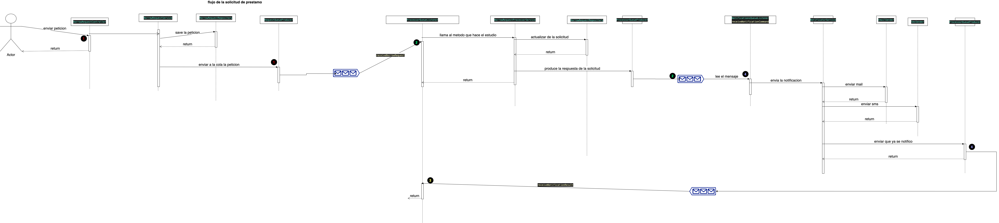
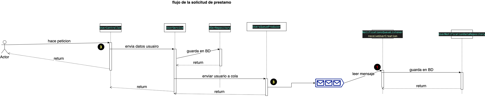

# Examen Sistemas distribuidos EAM 2020-2

## Arquitectura


## Proyectos

### SGC
Sistema de gestion de credito. compuesto por 2 partes:
1. **borrow-request**: Componente que recibe la peiticion de solicitud de prestamo. 
   Este recibe la solicitud mediante el API-REST, la guarda en BD con estado pendiente y la envia a la cola *borrow_process_queue*
2. **borrow-processor**: Componente que recibe el mensaje de la cola *borrow_process_queue* y aplica las reglas para verificar si se puede otorgar el credito como se explica  [aqui](sgc/src/main/java/co/edu/eam/sistemasdistribuidos/sgc/processor/services/BorrowRequestProcessorService.java) en el metodo *processRequest*. cuando se calcula la viabilidad se envia a la cola de *notifications_queue*. Los mensajes que lleguen por la cola de *notifications_result_queue* indican que la solicitud ya fue notificada y se debe actualizar el registro de solicitud para indicar que ya fue notificada.

### Notifier
proyecto para enviar las notificaciones que llegan por esta cola *notifications_queue*
los mensajes que llegan por aca tienen el user_id que es a quien se le enviara la notificacion. el servicio tiene la BD de usuarios con sus correos y numeros mobiles.  los usuarios se crean en el servicio de **users** se emite un mensaje a la cola *users_created_queue* y en este servicio se debe almacenar el user_id, mail y mobileNumber. este proyecto ya trae implementado el componente para enviar [mail](notificator/src/main/java/co/edu/eam/sistemasdistribuidos/borrownotificator/utils/EmailSender.java) y [SMS](notificator/src/main/java/co/edu/eam/sistemasdistribuidos/borrownotificator/utils/SmsSender.java) que deben ser usados para la resolucion de esta actividad. Cuando se notifica el resultado del estudio ya sea por SMS o correo se debe enviar un mensaje a la cola de *notifications_result_queue* para que el SGC actualice el registro de la solicitud de prestamo.

### Users
Proyecto que administra la gestion de los usuarios. cuando se crea un usuario se debe emitir un mensaje a la cola *users_created_queue* para que el servicio de notificaciones registre la informacion del numero de celular y correo del usuario.

## Asignacion
Este examen esta pensado para 4 personas y las asignaciones son:

### Estudiante 1
1. **API solicitar préstamo**.
   ```
    URL: /api/borrow/request
    Method: POST
    Body: 
    { 
        user_id:12331,
        salary: 1000,
        monthsSeniority: 12,
        credit_score: 500,
        amount: 1233,
        installments: 6
    }

    return:  id solicitud
   ```
   `Esto se debe realizar en el proyecto SGC.` [SGC](sgc)

   Aqui se debe recibir la solicitud, guardarla en BD con estado pending y ...

2. **producir solicitud préstamo**
   producir a la cola `borrow_process_queue`  para que se procese la solicitud

3. **consumir creación de usuario**. consumir el mensaje que llega de la cola `users_created_queue` y almacenar en la tabla `users_notification_data` los datos necesarios. esto se debe hacer en el proyecto de [notificaciones](notificator)

### Estudiante 2
1. **Api consultar solicitud préstamo** consultar una solicitud de prestamo. [SGC](sgc)
   ```
   URL /api/borrows/request/{idrequest}

   Verb: GET

   return borrow request
   ```

2. **Consumir solicitud de préstamo para estudio**
   Consumir de la cola `borrow_process_queue`  para procesar la solicitud de prestamo. Se debe emitir a la cola `notifications_queue` el resultado del procesamiento. [Proyecto SGC](sgc).

3. **Producir notificación resultado solicitud**
   producir a la cola `notifications_queue` el resultado del procesamiento de la solicitud. [Proyecto notificaciones](notificator)

### Estudiante 3
1. **Api crear usuario**. [Proyecto Users](users)
   ```
    URL: /api/users/

    metodo: POST

    Body:
    {
    user_id:
    name:
    lastName:
    mobileNumber:
    email:
    }
   ```
2. **producir creación de usuario.** [Proyecto Users](users).
    
   Produccion a la cola `users_created_queue` los datos del usuario creado.

3. **Consumir resultado de estudio para notificar**. [Proyecto SGC](sgc).

   Consumir de la cola `notifications_result_queue` y marcar el registro de solicitud de credito en `notified = true`.

### Estudiante 4
1. **API consultar usuario.**[Proyecto Users](users).

   
    ```
    URL: /users/{userId}

    metodo: GET

    Return: el objeto usuario
    ```
2. **Consumir resultado de estudio para notificar.**[Proyecto notificaciones](notificator)
   
   Consumir de la cola `notifications_queue` y notificar al usuario consultado su correo y telefono de la tabla `users_notification_data`. No se debe enviar correo si no tiene correo registrado y no se puedde enviar SMS si no tiene telefono registrado.

3. **Producir resultado notificación.**[Proyecto notificaciones](notificator)

    Cuando se notifique la solicitud enviar a la cola `notifications_result_queue` el id de la solicitud.

## Diagrama de secuencia

### Flujo solicitud prestamo


### Flujo creacion usuario



   

